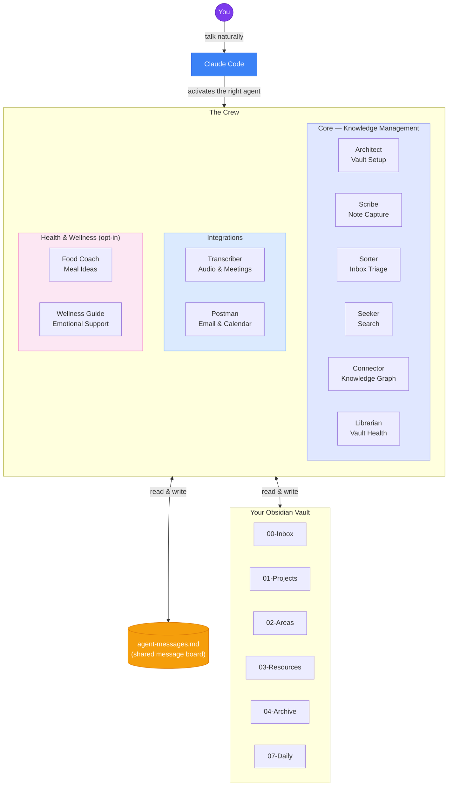
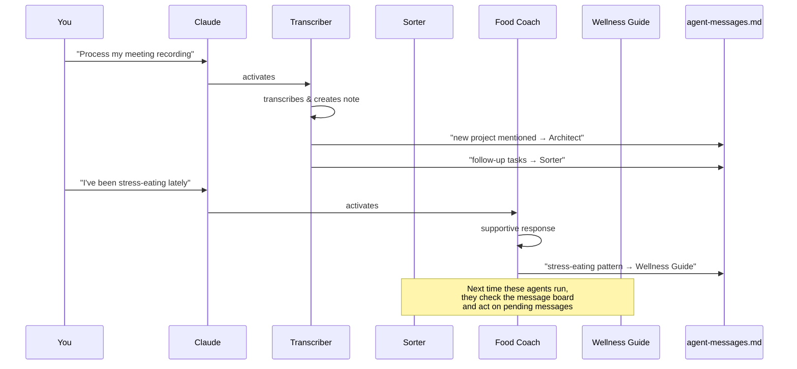

<p align="center">
  
  
  
  
</p>

# My Brain Is Full - Crew

### A team of 10 AI agents that manage your Obsidian vault — so your brain doesn't have to.

You talk. They organize, file, connect, search, transcribe, triage your email, plan your meals, and support your mental health. In any language.

---

## The honest origin story

I'm a PhD researcher. I've spent years training my brain to hold enormous amounts of information — papers, ideas, deadlines, people, half-baked theories at 2am. And for a while, it worked.

Then it didn't.

Memory started slipping. Not dramatically — no diagnosis, no crisis — just the slow, creeping realization that the mental budget was getting empty, and things were falling through the cracks. I'd forget what I'd read. Lose track of conversations.  Feel constantly behind, constantly overwhelmed.

I started looking for solutions. I found a lot of Obsidian + Claude setups online. They were mostly clever note-capture tools, glorified search engines for your second brain. Useful. But not what I needed.

What I needed wasn't just a memory extension. I needed a **brain dump system** — something that could help me organize not just my knowledge, but my life: my overwhelmed mind, my wrecked physical health, the avalanche of emails and commitments and things I should have done last week.

So I built this.

---

## What makes this different

Most "AI + Obsidian" tools are built for **people who already have their life together** and want to optimize. This one is for people who are **drowning** and need a lifeline.

**1. The chat IS the interface.**
I don't browse Obsidian. I don't drag files around. I don't maintain complex folder structures manually. I just talk to Claude. Everything else happens automatically.

**2. It's not just knowledge management.**
The Crew includes a **healthy eating companion** (because my physical health was falling apart too) and an **emotional wellness guide** (because the two things are connected). These aren't gimmicks — they're agents that coordinate with each other to support your overall wellbeing. Both are opt-in, and both always recommend consulting real professionals.

**3. It speaks your language — literally.**
The system works in any language. You shouldn't need to think in English to manage your brain. Just talk in Italian, French, German, Spanish, Japanese — whatever feels natural. The agents match you.

**4. The agents talk to each other.**
When the food coach notices you're stress-eating, it sends a message to the wellness guide. When the transcription agent processes a meeting, it flags follow-up tasks for the inbox manager. It's a crew, not a collection of isolated tools.

---

## Who this is for

- PhD students, researchers, academics drowning in papers and commitments
- Anyone with **brain fog**, or just an overloaded working memory
- People managing health challenges alongside cognitive work
- Non-native English speakers who want a system that works in their language
- Anyone who's tried Obsidian before and gave up because it felt like a second job

If you've ever thought *"I need to get organized, but I'm too exhausted to get organized"* — this is for you.

---

## Important disclaimers

> **Please read the [full disclaimers](docs/DISCLAIMERS.md) before using this project.**

Key points:

- **Health agents are not medical professionals.** The Food Coach and Wellness Guide produce AI-generated output — not medical advice, not therapy. Always consult real professionals. Both are opt-in.
- **This software is for personal use on your own data.** You are responsible for GDPR/CCPA compliance if you process third-party data (e.g., emails containing other people's information).
- **No warranty.** Provided "as is". Back up your vault. The author accepts no liability.
- **No responsibility for forks or misuse.** This is a self-care tool. Malicious repurposing is explicitly condemned.

> **By using this software, you agree to the [Terms of Use](TERMS_OF_USE.md).** During onboarding, the Architect will ask you to explicitly accept these terms before proceeding.

---

## The Crew

| # | Agent | Role | Superpower |
|---|-------|------|------------|
| 1 | **Architect** | Vault Structure & Setup | Designs your entire vault, runs onboarding, sets the rules everyone follows |
| 2 | **Scribe** | Text Capture | Transforms your messy, typo-filled, stream-of-consciousness dumps into clean notes |
| 3 | **Sorter** | Inbox Triage | Empties your inbox every evening — routes every note to its perfect home |
| 4 | **Seeker** | Search & Intelligence | Finds anything in your vault, synthesizes answers across notes with citations |
| 5 | **Connector** | Knowledge Graph | Discovers hidden links between your notes — even ones you'd never think of |
| 6 | **Librarian** | Vault Maintenance | Weekly health checks, deduplication, broken link repair, growth analytics |
| 7 | **Transcriber** | Audio & Meetings | Turns recordings and transcripts into rich, structured meeting notes |
| 8 | **Postman** | Email & Calendar | Bridges Gmail and Google Calendar with your vault — deadline radar, meeting prep |
| 9 | **Food Coach** | Healthy Eating Companion | Meal ideas, grocery lists, food preferences, general wellness motivation (opt-in) |
| 10 | **Wellness Guide** | Emotional Wellness | Active listening, grounding techniques, stress support — always recommends professionals (opt-in) |

> **The agents talk to each other.** When the Food Coach notices stress-eating patterns, it flags the Wellness Guide. When the Transcriber processes a meeting, it alerts the Sorter. When the Postman finds emails about a new project, it tells the Architect to create a folder. It's a crew, not a collection of isolated tools.

---

## How it works

```
You talk to Claude  →  The right agent activates  →  Your vault gets updated
```

Each crew member is an isolated AI with its own system prompt, tool restrictions, and model assignment. You clone the repo into your vault, run a setup script, and from that moment on you manage everything through conversation. No GUI, no drag-and-drop, no manual file management.

### Architecture



### Agent Communication Flow



### Works on both Claude Code CLI and Claude Code Desktop (Cowork)

The installer sets up **two parallel formats** so the Crew works everywhere:

| Format | Location | Used by |
|--------|----------|---------|
| **Subagents** | `.claude/agents/` | Claude Code CLI (`claude` in terminal) |
| **Skills** | `.claude/skills/` | Claude Code Desktop / Cowork |

You don't need to choose — `launchme.sh` installs both automatically. Same agents, same behavior, same prompts. The only difference is the format Claude reads them in.

Your vault follows a hybrid **PARA + Zettelkasten** structure:

```
00-Inbox/          Capture everything here first
01-Projects/       Active projects with deadlines
02-Areas/          Ongoing responsibilities (including Health)
03-Resources/      Reference material, guides, how-tos
04-Archive/        Completed or historical content
05-People/         Your personal CRM
06-Meetings/       Timestamped meeting notes
07-Daily/          Daily notes and journals
MOC/               Maps of Content — thematic indexes
Templates/         Obsidian note templates
Meta/              Vault config, agent messages, health reports
```

---

## Quick start

> **Prerequisite**: You need [Claude Code](https://claude.ai/code) with a Claude Pro, Max, or Team subscription, and [Obsidian](https://obsidian.md) (free).

### 1. Create your Obsidian vault

Open Obsidian and create a new vault (or use an existing one).

### 2. Clone the repo inside your vault

```bash
cd /path/to/your-vault
git clone https://github.com/gnekt/My-Brain-Is-Full-Crew.git
```

### 3. Run the installer

```bash
cd My-Brain-Is-Full-Crew
bash scripts/launchme.sh
```

The script asks a couple of questions and copies the agents into your vault's `.claude/` directory. That's it — when Claude Code is open in your vault folder, the agents activate automatically. When you're in any other project, they don't.

> **Never used a terminal before?** See the [step-by-step guide for beginners](docs/getting-started.md) — it walks you through everything, or just show this page to a tech-savvy friend. It takes 60 seconds.

### 4. Initialize

Open Claude Code **inside your vault folder** and say:

> **"Initialize my vault"**

The **Architect** will start a friendly onboarding conversation:

1. **Who are you?** — Name, language, role, what brought you here
2. **What do you need?** — Which agents to activate, which areas of life to manage
3. **Health setup** *(optional)* — Physical profile for the Food Coach, preferences for the Wellness Guide
4. **Integrations** — Gmail and Google Calendar connections

After onboarding, the Architect creates your entire vault folder structure, saves your profile, leaves you a welcome note, and you're ready to go.

### 5. Start using it

| You say | What happens |
|---------|-------------|
| *"Save this: meeting with Marco about the Q3 budget, he wants the report by Friday"* | **Scribe** captures it as a clean note with tasks, wikilinks, and deadline |
| *"Triage my inbox"* | **Sorter** files everything, updates MOCs, gives you a summary |
| *"What did we decide about the pricing strategy?"* | **Seeker** searches your vault, synthesizes the answer with source citations |
| *"Check my email"* | **Postman** scans Gmail, saves important emails, flags deadlines |
| *"What should I eat this week?"* | **Food Coach** creates a personalized meal plan based on your profile |
| *"I'm feeling overwhelmed"* | **Wellness Guide** guides you through grounding techniques and helps you decompress |
| *"Weekly review"* | **Librarian** runs a full vault audit — broken links, duplicates, health score |
| *"Find connections for my latest note"* | **Connector** discovers hidden links to other notes in your vault |

---

## Works in any language

The Crew is built in English but **responds in whatever language you write in**. Italian, French, Spanish, German, Portuguese, Japanese — just talk, and the agents match you.

```
"Salva questa nota veloce..."          → Scribe responds in Italian
"Vérifie mon email..."                 → Postman responds in French
"Was habe ich diese Woche geplant?"    → Food Coach responds in German
"Check my inbox"                       → Sorter responds in English
```

No translations to install. No language packs. It just works.

---

## Agent inter-communication

Agents coordinate through a shared message board at `Meta/agent-messages.md`. This creates a lightweight asynchronous coordination layer:

- The **Postman** finds emails about a medical appointment → leaves a message for the **Food Coach**
- The **Sorter** finds an emotional journal entry → flags it for the **Wellness Guide**
- The **Transcriber** processes a meeting that introduces a new project → alerts the **Architect**
- The **Food Coach** notices stress-eating patterns → coordinates with the **Wellness Guide**
- The **Connector** finds orphan notes → asks the **Librarian** to investigate

No agent works in isolation. The crew is greater than the sum of its parts.

---

## Required integrations

The **Postman** agent requires:
- **Gmail** MCP connector — to read and process your inbox
- **Google Calendar** MCP connector — to import events and manage your schedule

The `launchme.sh` script offers to set up `.mcp.json` in your vault automatically. You just need to authorize them when prompted by Claude Code.

All other agents work with just your local Obsidian vault — no integrations needed.

### Updating

After pulling new changes from the repo:

```bash
cd /path/to/your-vault/My-Brain-Is-Full-Crew
git pull
bash scripts/updateme.sh
```

Only changed files are updated. Your vault notes are never touched.

---

## Recommended Obsidian plugins

**Essential:** Templater, Dataview, Calendar, Tasks

**Recommended:** QuickAdd, Folder Notes, Tag Wrangler, Natural Language Dates, Periodic Notes, Omnisearch, Linter

---

## Project structure

```
My-Brain-Is-Full-Crew/               ← cloned inside your vault
├── agents/                          The 10 subagents
│   ├── architect.md                   Vault setup & onboarding
│   ├── scribe.md                      Text capture & note creation
│   ├── sorter.md                      Inbox triage & filing
│   ├── seeker.md                      Search & knowledge retrieval
│   ├── connector.md                   Knowledge graph & link analysis
│   ├── librarian.md                   Vault health & maintenance
│   ├── transcriber.md                 Audio & meeting transcription
│   ├── postman.md                     Email & calendar integration
│   ├── food-coach.md                  Nutrition coaching (opt-in)
│   └── wellness-guide.md              Mental health support (opt-in)
├── skills/                          Auto-generated skills (for Cowork/Desktop)
│   └── {name}/SKILL.md               One per agent, same content
├── references/                      Shared agent documentation
├── scripts/
│   ├── launchme.sh                    First-time installer
│   ├── updateme.sh                    Post-pull updater
│   └── generate-skills.py             Converts agents → skills
├── docs/                            User-facing documentation
│   ├── getting-started.md             Step-by-step setup guide
│   ├── examples.md                    Real-world usage examples
│   └── agents/                        Deep-dive into each agent
├── .mcp.json                        MCP servers (Gmail, Google Calendar)
├── .claude-plugin/plugin.json       Plugin manifest (for --plugin-dir)
├── LICENSE
├── README.md                        You are here
└── CONTRIBUTING.md
```

After running `launchme.sh`, your vault looks like:

```
your-vault/
├── .claude/
│   ├── agents/          ← crew subagents (Claude Code CLI)
│   ├── skills/          ← crew skills (Claude Code Desktop / Cowork)
│   └── references/      ← shared docs
├── CLAUDE.md            ← project instructions
├── .mcp.json            ← Gmail + Calendar (if enabled)
├── My-Brain-Is-Full-Crew/  ← the repo (for updates)
└── ... your Obsidian notes
```

---

## Contributing — seriously, please help

This started as one person's survival tool. I'm sharing it because I think it can help others, but **I know it can be much better** — and I need help from people who know Claude Code, prompt engineering, and Obsidian better than I do.

**Every single PR is welcome.** I mean it. If you see something that could be improved — a better prompt structure, a smarter agent behavior, a more elegant architecture — please submit it. I won't be precious about my code. The goal is to help people, not to protect my ego.

If you want to:
- **Improve an agent** — make it smarter, add a mode, fix edge cases
- **Fix my prompts** — if you know better patterns, teach me
- **Propose a new crew member** — a new agent for a new domain
- **Report a bug** — something an agent does wrong
- **Add examples** — share how you use the Crew
- **Just tell me what I'm doing wrong** — I'll listen

...PRs, issues, and honest feedback are all welcome. See [CONTRIBUTING.md](CONTRIBUTING.md).

---

## Philosophy

> *"The best organizational system is the one you actually use."*

The Crew is designed for people who are overwhelmed, not for people who enjoy organizing. Every design decision prioritizes **minimum friction**:

- **Chat is the interface** — no manual file management
- **Agents handle the boring stuff** — filing, linking, maintaining
- **Health is not separate from productivity** — your body and mind affect your work
- **Any language, any time** — your brain shouldn't have to switch languages to stay organized
- **Conservative by default** — agents never delete, always archive. They ask before making big decisions.

---

## Star this repo

If the Crew helps you — or if you just think it's a cool idea — consider starring this repo. It helps others find it, and it motivates continued development.

---

## License

MIT — use it, modify it, share it. Just keep the attribution.

**THE SOFTWARE IS PROVIDED "AS IS", WITHOUT WARRANTY OF ANY KIND, EXPRESS OR IMPLIED.** The authors are not liable for any claim, damages, or other liability arising from the use of this software. This includes, without limitation, any health-related advice or output generated by the Food Coach and Wellness Guide agents. See the [MIT License](LICENSE) for full terms.

---

<p align="center">
  <i>Built by someone who got tired of forgetting things.</i>
  <br><br>
  <a href="docs/getting-started.md"><strong>Get Started</strong></a> · <a href="docs/examples.md"><strong>Examples</strong></a> · <a href="docs/agents/architect.md"><strong>Meet the Agents</strong></a> · <a href="CONTRIBUTING.md"><strong>Contribute</strong></a>
</p>
